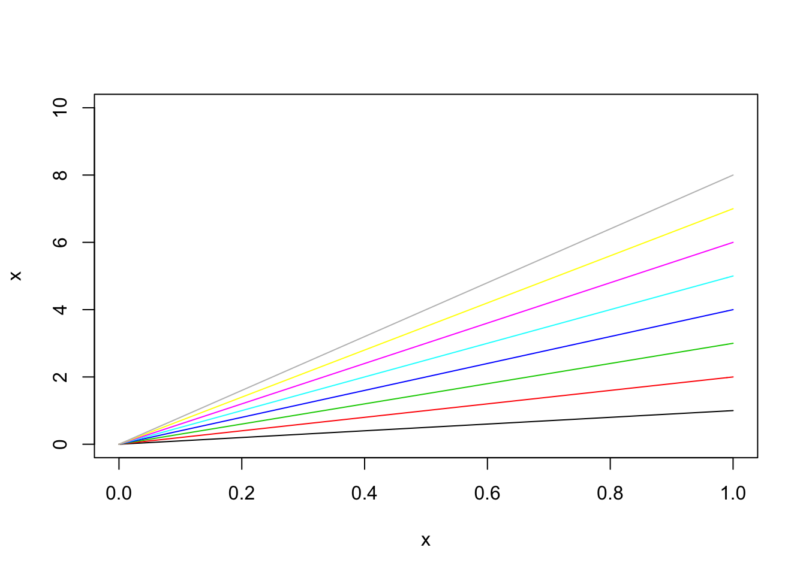
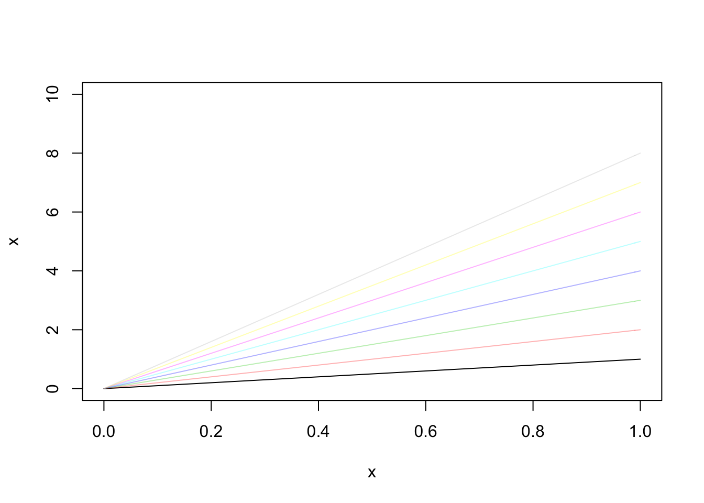

# 统计图形笔记
使用 ``` palette() ``` 进行批量获得色彩
比如说


```r
x=seq(0,1,0.01)
plot(x,x,type='l',ylim=c(0,10))
for (i in 2:10) {
  lines(x,i*x,type = 'l',col=palette()[i])
}
```



可以使用```adjustcolor(palette()[i], alpha.f = 0.5) ``` 给上述色彩增加透明度
例如:

```r
plot(x,x,type='l',ylim=c(0,10))
for (i in 2:10) {
  lines(x,i*x,type = 'l',col=adjustcolor(palette()[i], alpha.f = 0.3))
}
```


